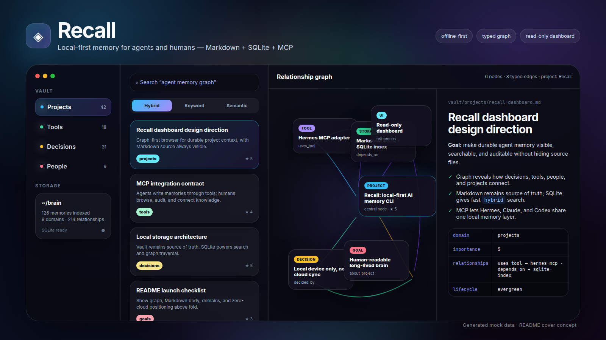

# Recall



Recall is a local-first memory layer for AI agents: **Markdown for humans, SQLite for search, MCP for agents.**

Agents write structured durable facts through CLI/MCP/API. Humans browse, search, inspect, and audit those memories through a read/view-first UI. The source of truth stays as Markdown on your machine; SQLite is a rebuildable local index.

> Agents write. Humans inspect. Recall indexes. MCP retrieves.

## Status

**Alpha.** Recall is early local-first memory infrastructure for agents, not a finished product and not a hosted service.

Storage is local device only: no cloud sync, no hosted API, no remote database, no multi-user collaboration layer.

## Why Recall exists

AI agents lose context between sessions, tools, and products. Recall gives them a durable, portable, inspectable memory layer:

- **Local-first memory** — data lives on your machine, not a cloud SaaS.
- **Markdown source of truth** — humans can inspect and manually fix memories when needed.
- **SQLite index** — agents can search/filter quickly without parsing the whole vault every time.
- **MCP interface** — Hermes, Claude, Codex, or other MCP clients can use the same memory tools.
- **CLI + TUI + read-only web UI** — scriptable for agents, inspectable for humans.
- **Agent setup docs/skills/scripts** — practical bootstrap path, not only a library.

## What Recall is not

Recall is intentionally **not**:

- production-ready;
- universal memory for every app;
- a Mem0, Letta, LangGraph Memory, Chroma, or sqlite-vec replacement;
- an Obsidian replacement;
- an “agent OS”;
- a hosted team memory service.

It is experimental, hackable, Markdown-native, MCP-ready agent memory infrastructure.

## Who it is for

Good fit:

- Hermes / Claude / Codex power users;
- local-first and privacy-focused AI users;
- Obsidian + AI users who want agent-readable structure;
- developers building personal agents;
- people tired of agent context loss.

Bad fit:

- no-code users;
- teams expecting hosted sync/cloud/collaboration;
- enterprise deployments;
- users expecting a polished notes app UI;
- anyone who wants human-first note editing as the main workflow.

## Why not just Obsidian?

Obsidian is human-first. Recall is agent-first but human-readable.

Recall adds:

- structured frontmatter;
- domains;
- lifecycle and importance metadata;
- typed relationships;
- MCP tools for agents;
- searchable SQLite index;
- rebuild/reindex flow;
- agent policies and setup templates.

Markdown remains the source of truth, so manual editing is still an advanced escape hatch. The product path is not “better notes app”; it is durable memory infrastructure agents can write and humans can audit.

## Quickstart in 3 minutes

```bash
# 1. Build Recall
make build

# 2. Create a local memory project
./bin/recall init --path ~/brain

# 3. Add a memory through the CLI
RECALL_PROJECT=$HOME/brain ./bin/recall add \
  --title "Use local-first agent memory" \
  --domain decisions \
  --importance 4 \
  --body "Recall stores agent-written durable memory as Markdown plus a SQLite index."

# 4. Search it
RECALL_PROJECT=$HOME/brain ./bin/recall search "local-first agent memory"

# 5. Inspect in the read/view-first UI
RECALL_PROJECT=$HOME/brain ./bin/recall ui --port 8888
```

For MCP setup, see [MCP setup](#mcp-setup) and [LLM setup](docs/llm-setup.md).

## What it stores

A Recall project contains:

- `vault/` — source of truth. Markdown memories grouped by domain folders.
- `db/recall.sqlite` — rebuildable SQLite search/index database.
- `vault/README.md` and per-domain `README.md` files — human/agent guidance for what belongs where.

Default domains include `tools`, `inbox`, `people`, `projects`, `decisions`, `research`, and `goals`. Add custom domains with `recall domain add`. Memories are intended to be written by agents or scripts through CLI/MCP/API; the web UI is read/view-first so humans can audit what was stored.

## Install / build

Prerequisites:

- Go matching `go.mod`.
- Node.js 22+ and npm for UI builds.
- Git.

Build full binary with embedded UI:

```bash
make build
./bin/recall version
```

Build CLI/API without embedded UI assets:

```bash
make build-nui
./bin/recall version
```

Difference:

- `make build` runs `npm --prefix ui ci`, builds React assets, then builds Go with `-tags ui`. `recall ui` serves embedded UI.
- `make build-nui` builds only Go without Node. `recall ui` still starts API, but SPA serving returns `503` with “recall UI not built.”

## Initialize workspace

```bash
recall init --path ~/brain
```

Change Recall to an existing project directory without the interactive init
prompt:

```bash
recall use /path/to/existing/folder
```

This preserves existing files and creates missing `vault/` and `db/` scaffold
folders. Point at the project root, not directly at `vault/`.

Config path is OS-dependent. On Linux it is usually:

```text
~/.config/recall/config.json
```

Useful environment overrides:

- `RECALL_PROJECT=/path/to/project` — project root containing `vault/` and `db/`.
- `RECALL_HOME=/path/to/config-dir` — config directory used by Recall.

Environment variables override saved config and are useful for tests, temporary projects, and agent sandboxes.

## CLI examples

Add memory:

```bash
recall add --title "SQLite WAL note" --domain tools --tags sqlite,go --importance 4 --body "Use WAL plus busy_timeout for local concurrent reads/writes."
```

Add typed relationships as graph edges:

```bash
recall add \
  --title "Hermes uses Recall MCP" \
  --domain tools \
  --relationships '[{"target_id":"01PROJECT...","type":"uses_tool","note":"stdio MCP"}]' \
  --body "Hermes stores durable memory in Recall over MCP."
```

Pipe body from stdin:

```bash
printf 'Decision rationale here\n' | recall add --title "Use local-only storage" --domain decisions --project recall
```

Search:

```bash
recall search sqlite --domain tools --limit 10
recall search --tag go --project recall --json
```

Populate local embedding cache with Ollama:

```bash
ollama pull nomic-embed-text
recall embed --provider ollama --model nomic-embed-text
```

Semantic and hybrid search:

```bash
recall search "phone sync" --semantic --provider ollama --model nomic-embed-text
recall search "phone sync" --hybrid --provider ollama --model nomic-embed-text --json
```

`embedded: 0, skipped: N` means vectors already exist for unchanged memories. Use `--force` to rebuild.

Importance is an integer from 1–5. `3` is default durable memory; `5` is critical operating context such as stable paths, preferences, and integration configs. Keyword search ranking blends full-text relevance, recency, and importance. Semantic and hybrid modes use the SQLite embedding cache.

Relationships are typed directed edges from one memory to another. Supported types: `related_to`, `about_project`, `uses_tool`, `depends_on`, `decided_by`, `supersedes`, `contradicts`, `references_person`. Markdown frontmatter is source of truth; SQLite stores `memory_relationships` as rebuildable graph index rows.

Get memory:

```bash
recall get 01ABCDEF
recall get 01ABCDEF --json
```

Delete memory:

```bash
recall delete 01ABCDEF --yes
```

Manage domains:

```bash
recall domain list
recall domain add personal-notes --desc "Private notes and observations."
```

Rebuild index from Markdown vault:

```bash
recall reindex
```

Check workspace health:

```bash
recall doctor
```

Open TUI:

```bash
recall
```

Start web UI/API:

```bash
recall ui --port 8888
recall ui --port 8888 --no-browser
```

The web UI is intentionally read/view-first for memories: browse, search, inspect metadata, and follow graph relationships. Create/update/delete memories through CLI, MCP, or API so agents and scripts prepare structured durable data before it enters the vault.

## MCP setup

Run MCP server over stdio:

```bash
recall mcp
```

Example MCP server config shape for an agent:

```json
{
  "mcpServers": {
    "recall": {
      "command": "recall",
      "args": ["mcp"],
      "env": {
        "RECALL_PROJECT": "/home/you/brain"
      }
    }
  }
}
```

Use absolute paths when configuring long-lived agent processes.

MCP gives agents memory tools. For consistent behavior, also give agents the bootstrap policy in [`docs/agent-instructions.md`](docs/agent-instructions.md). Full LLM setup lives in [`docs/llm-setup.md`](docs/llm-setup.md). Copy [`docs/templates/AGENTS.md`](docs/templates/AGENTS.md) into agent-managed repositories, or install the Hermes-compatible skill template at [`skills/recall-memory/SKILL.md`](skills/recall-memory/SKILL.md).

## Web UI / API development

Run API and Vite dev UI together:

```bash
recall dev
recall dev --api-port 8888 --ui-port 5173 --install
```

`--install` runs `npm --prefix ui ci` before starting Vite.

Run API/UI server from Go:

```bash
make build
recall ui --no-browser --port 8888
```

Run Vite dev server for frontend work:

```bash
cd ui
npm ci
npm run dev
```

The REST API lives under `/api/` and includes:

- `GET /api/domains`
- `POST /api/domains`
- `GET /api/memories` (`mode=keyword|semantic|hybrid`, `provider`, and `model` are supported for vector search)
- `GET /api/memories/:id`
- `POST /api/memories`
- `PUT /api/memories/:id`
- `DELETE /api/memories/:id`
- `POST /api/reindex`

## Checks

Full local check:

```bash
make check
```

Individual checks:

```bash
make fmt-check
make tidy-check
make vet
make test
make race
make cover
make generate-check
make install-ui
make lint-ui
make test-ui
make build-ui
make audit-ui
make build-nui
make build
make test-ui-tag
```

Generated sqlc code freshness:

```bash
make generate-check
```

`make generate-check` runs sqlc `v1.30.0` and fails if generated files under `internal/index/db/` differ from committed output.

## Local security model

Recall is local-first and assumes local device trust, not hostile multi-user hosting.

- The web API is unauthenticated and intended for loopback use only.
- `recall ui` listens on `localhost`.
- API middleware rejects non-loopback hostnames to reduce DNS-rebinding risk.
- CORS allowlist is limited to local Vite dev origins (`localhost:5173`, `127.0.0.1:5173`).
- Do not expose Recall’s API port to LAN/WAN or run it behind public reverse proxies without adding authentication.

## Roadmap

Near-term polish before wider launch:

- screenshot/GIF of CLI + read/view-first UI;
- stronger example showing an agent remembering a project decision across sessions;
- more copy-paste MCP configs for popular clients;
- relationship graph browsing;
- safer review workflow for agent-written memories;
- optional sync/export story without making cloud required.

## More docs

- [Vector search](docs/vector-search.md)
- [Development guide](docs/development.md)
- [Code quality roadmap](docs/plans/2026-06-08-code-quality-roadmap.md)
